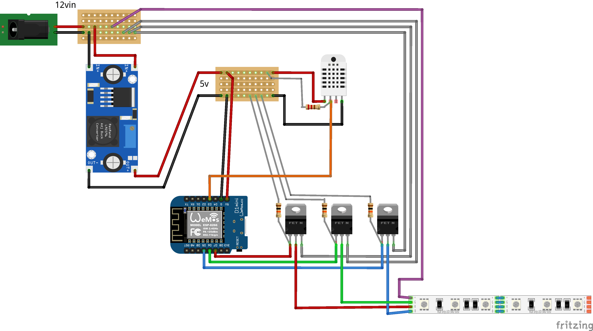

# RGB LED Strip controller

RGB LED strip controller + mini Weather station, built using the Arduino platform.

## File Structure

- `src/`
  - `src.ino` : Entry point 
  - `config.h`:  Pin mappings, refresh rates, device version
  - `env.h`:  WiFi config
  - `components/`: Hardware components
  - `domain/`: System logic

## Project setup

The project is configured to be used with the VSCode editor for editing comfort, but can definitely be 
built with just the `arduino-cli` and `python 3`. 

### VSCode configuration

1. Create a copy of the `.vscode/c_cpp_properties.example.json` file and rename it to `.vscode/c_cpp_properties.json`

2. Install the [Arduino extension](https://marketplace.visualstudio.com/items?itemName=vsciot-vscode.vscode-arduino)

3. Install the required libraries using the "Arduino: Library Manager" command from the command palette.
    - DHT sensor library by Adafruit
    - AsyncTimer by Aasim-A
    - ArduinoJson by Benoit Blanchon  


4. Run the "Arduino: Rebuild IntelliSense Configuration" command from the command palette. 

5. Create a copy of the `src/env.example.h` file and rename it to `src/env.h`. 
    - Fill in the required values for the WiFi SSID and password.

### Building the project

1. Install the `arduino-cli` tool from [here](https://arduino.github.io/arduino-cli/latest/installation/)

2. Run the `compile.py` script. 

```bash
python3 cli/compile.py <version_number>
```

The script will create a `build/bin` directory and place the binary in it.
The binary will be named `<version_number.bin` and can be uploaded to the micro controller using the `arduino-cli` tool.

### Uploading the binary

There are two ways to upload the binary to the micro controller:

1. Using the `arduino-cli` tool: required for first time upload.
2. Via Over The Air (OTA) update: can be used for subsequent updates, requires the board to already have the sketch on board and connected to your local network.

#### Using `arduino-cli`

Run

1. Build the project using the `compile.py` script.
2. Run the following command to upload the binary to the micro controller

TODO: Add explanation for the cli arguments

```bash
arduino-cli upload -i ./build/bin/<latest_version>.bin -b esp8266:esp8266:d1_mini_clone -p /dev/cu.usbserial-130
```

#### OTA update

- 1. Build the project using the `compile.py` script.
- 2. Start the update server (skip if already running)

    ```bash
    python3 cli/server.py
    ```

- 3. Send a `POST` request to the `settings/version/update/` endpoint of the micro controller

    ```plain
    <controller_ip>/settings/version/update/<update_server_ip>/<update_server_port>/update
    ```

## Hardware

### Components

- WeMos D1 mini (micro controller)
- DHT22 (temperature & humidity sensor)
- LM2596S Step-down voltage regulator
- IRLZ44N (N-channel, logic-level MOSFET Transistor) x 3
- 10kΩ Resistor x 4
- 5.5X2.1mm DC Power jack
- SMD 5050 RGB Strip

### Circuit diagram


